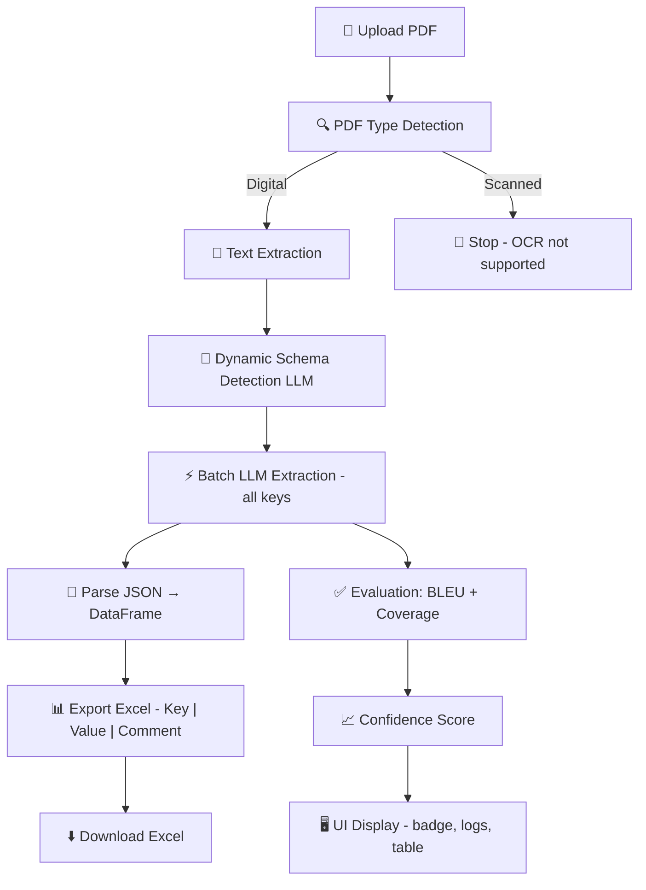

# 📊 PDF Excel Extractor

> 🤖 AI-Powered Document Structuring & Data Extraction System
>
> Production-ready AI agent that extracts structured data from unstructured PDF documents using LLM-powered semantic analysis.

[](https://www.python.org/)
[](https://fastapi.tiangolo.com/)
[](LICENSE)

[](https://pdf-excel-extractor-912303930048.us-central1.run.app/)

---

## 🌟 Key Features

✨ **Dynamic Schema Detection** - LLM analyzes documents to determine relevant fields (no hardcoded schema)  
🎯 **Semantic Understanding** - Converts narrative text PDFs into structured Excel spreadsheets  
📈 **Quality Assurance** - Built-in evaluation with BLEU scores and coverage metrics  
⚡ **Batch Processing** - Efficient single LLM call for all data extraction  
🔍 **PDF Type Detection** - Automatically identifies digital vs. scanned documents  
📥 **REST API** - Complete API with upload, status polling, and download endpoints

---

## ⚠️ Important Note

> **The application generates an Excel file for each job and serves it for download, but Excel files are not persisted permanently on the server.**
>
> ⚡ **Please download the Excel result immediately after the job completes.**
>
> The UI table is provided for visual inspection only and is not a stored copy of the Excel file.

---

## 🚀 Quick Start

### Prerequisites

- 🐍 Python 3.8 or higher
- 🔑 Mistral API key ([get one here](https://console.mistral.ai/))

### Installation

1️⃣ **Clone the repository**

```bash
git clone https://github.com/wsmaisys/pdf-excel-extractor.git
cd pdf-excel-extractor
```

2️⃣ **Create and activate a Python virtual environment**

**Windows (PowerShell):**

```powershell
python -m venv .venv
.\.venv\Scripts\Activate.ps1
```

**Linux/Mac:**

```bash
python -m venv .venv
source .venv/bin/activate
```

3️⃣ **Install dependencies**

```bash
pip install -r requirements.txt
```

4️⃣ **Configure environment variables**

```bash
cp .env.example .env
# Edit .env and add your MISTRAL_API_KEY
```

5️⃣ **Run the server**

```bash
uvicorn app.main:app --reload --port 8000
```

6️⃣ **Open the UI**

```
http://localhost:8000
```

Or use the live demo (Cloud Run):

```
https://pdf-excel-extractor-912303930048.us-central1.run.app/
```

---

## 📊 Workflow Diagram



---

## 🗂️ Project Structure

```
pdf-excel-extractor/
│
├── 📁 app/
│   └── main.py                    # 🚀 FastAPI server & job orchestration (entrypoint)
│
├── 📁 pipeline/
│   ├── schema_detector.py         # 🧠 LLM-based schema/key detection
│   ├── llm_extractor.py          # ⚡ Builds batch prompt, calls LLM with retry/backoff
│   ├── exporter.py               # 📊 Converts extraction JSON to pandas DataFrame & Excel
│   └── extract_kv.py             # 🔧 Heuristic post-processing for key-value pairs
│
├── 📁 tools/
│   └── pdf_detection.py          # 🔍 Checks whether PDF is digital or scanned
│
├── 📁 evaluation/
│   └── bleu_scorer.py            # 📈 BLEU score & coverage metrics for confidence
│
├── 📁 static/
│   └── index.html                # 🖥️ Web UI (upload, poll, render table, confidence badge)
│
├── 📄 pipeline_runner.py          # 🔧 CLI runner for offline/batch execution
├── 📄 requirements.txt            # 📦 Python dependencies
├── 📄 .env.example               # 🔑 Environment variables template
├── 📄 Dockerfile                 # 🐳 Docker container configuration
├── 📄 plan.md                    # 📝 Project planning document
└── 📄 API_DOCUMENTATION.md        # 📚 Complete API reference with examples
```

---

## 📁 File Descriptions

### 🎯 Core Application

#### `app/main.py`

🚀 **FastAPI Server & Job Orchestrator**

- Entry point for the application
- Manages job lifecycle and background tasks
- Handles file uploads and serves the web interface
- Coordinates all pipeline components

#### `static/index.html`

🖥️ **Web User Interface**

- Interactive upload interface
- Real-time job status polling
- Data table rendering
- Confidence score badge display
- Download management

---

### 🔧 Pipeline Components

#### `pipeline/schema_detector.py`

🧠 **Dynamic Schema Detection**

- Uses LLM to analyze PDF content
- Automatically identifies relevant data fields
- No hardcoded schemas required
- Adapts to different document types

#### `pipeline/llm_extractor.py`

⚡ **Batch LLM Extraction Engine**

- Constructs optimized batch prompts
- Single LLM API call for efficiency
- Implements retry logic with exponential backoff
- Extracts all key-value pairs simultaneously

#### `pipeline/exporter.py`

📊 **Data Export Module**

- Converts JSON extraction results to pandas DataFrame
- Generates Excel files with structured format
- Columns: Key | Value | Comment
- Handles data formatting and validation

#### `pipeline/extract_kv.py`

🔧 **Heuristic Post-Processor**

- Optional refinement of extracted data
- Pattern-based key-value pair detection
- Enhances LLM extraction accuracy
- Fallback extraction methods

---

### 🛠️ Utility Tools

#### `tools/pdf_detection.py`

🔍 **PDF Type Classifier**

- Distinguishes between digital and scanned PDFs
- Prevents processing of OCR-required documents
- Fast pre-processing validation
- Saves API costs on incompatible files

---

### 📈 Evaluation System

#### `evaluation/bleu_scorer.py`

📊 **Quality Assessment Module**

- Calculates BLEU scores for extraction accuracy
- Measures field coverage completeness
- Generates confidence scores (0-100%)
- Provides quality metrics for monitoring

---

### 🔧 Additional Files

#### `pipeline_runner.py`

🖥️ **CLI Batch Runner**

- Command-line interface for offline processing
- Batch job execution without web server
- Useful for automation and testing
- Direct pipeline access

#### `requirements.txt`

📦 **Python Dependencies**

- FastAPI and Uvicorn (web framework)
- pandas, openpyxl (data processing)
- PyPDF2 or pdfplumber (PDF parsing)
- requests (HTTP client)
- python-dotenv (environment management)

#### `.env.example`

🔑 **Environment Configuration Template**

- API key placeholders
- Server configuration defaults
- Copy to `.env` and customize

#### `Dockerfile`

🐳 **Container Configuration**

- Production deployment setup
- Isolated environment
- Easy scaling and distribution

#### `plan.md`

📝 **Project Planning Document**

- Development roadmap
- Feature specifications
- Architecture decisions

#### `API_DOCUMENTATION.md`

📚 **Complete API Reference**

- Endpoint specifications
- Request/response schemas
- cURL examples
- Python requests snippets

---

## 🔌 API Endpoints

### 📤 Upload PDF

```http
POST /upload
Content-Type: multipart/form-data
```

**Response:** `{ "job_id": "uuid" }`

### 📊 Check Status

```http
GET /status/{job_id}
```

**Response:** Job status, logs, extracted data, and evaluation results

### ⬇️ Download Excel

```http
GET /download/{job_id}
```

**Response:** Excel file download

> 💡 See [API_DOCUMENTATION.md](API_DOCUMENTATION.md) for complete examples with cURL and Python requests

---

## 🔄 Processing Pipeline

1. 📤 **Upload PDF** via UI or `pipeline_runner.py`
2. 🔍 **Type Detection** - `app/main.py` runs `tools/pdf_detection.py` (digital vs scanned)
3. 📝 **Text Extraction** - Extract text if digital PDF
4. 🧠 **Schema Detection** - `pipeline/schema_detector.py` identifies relevant fields via LLM
5. ⚡ **Data Extraction** - `pipeline/llm_extractor.py` performs single batch LLM call
6. 🔧 **Post-Processing** - Optional refinement with `pipeline/extract_kv.py`
7. 📈 **Evaluation** - `evaluation/bleu_scorer.py` calculates confidence metrics
8. 📊 **Export** - `pipeline/exporter.py` creates Excel file
9. ⬇️ **Download** - Serve via `/download/{job_id}` endpoint

---

## 🎯 Use Cases

✅ **Invoice Processing** - Extract vendor, amount, date, items  
✅ **Resume Parsing** - Pull out skills, experience, education  
✅ **Contract Analysis** - Identify parties, dates, terms  
✅ **Report Mining** - Extract key metrics and findings  
✅ **Form Digitization** - Convert filled forms to structured data

---

## 🚀 Deployment

### Docker Deployment

```bash
docker build -t pdf-excel-extractor .
docker run -p 8000:8000 --env-file .env pdf-excel-extractor
```

### Prebuilt Docker image (available on Docker Hub)

A prebuilt image has been pushed to Docker Hub so you can pull and run
without building locally. The image includes the LLM-enabled build.

```bash
# Pull the prebuilt image (LLM-enabled build)
docker pull wasimansariiitm/pdf-excel-extractor:llm

# Run the container and map port 8000 (reads .env for API keys)
docker run -p 8000:8000 --env-file .env wasimansariiitm/pdf-excel-extractor:llm
```

Available tags: `latest`, `pdf-extractor`, `pdf-to-excel`, `fastapi`, `mistral-ai`, `llm`.

### Production Considerations

- 🔐 Add authentication/authorization
- 📊 Implement rate limiting
- 💾 Add persistent storage for job history
- 🔄 Set up background job queue (Celery/Redis)
- 📈 Add monitoring and logging (Prometheus/Grafana)

---

## 🧪 Testing

### Run CLI Pipeline

```bash
python pipeline_runner.py --input sample.pdf --output results/
```

### API Testing

Use the examples in `API_DOCUMENTATION.md` with cURL or Python requests library.

---

## 🤝 Contributing

Contributions are welcome! Please feel free to submit a Pull Request.

1. Fork the repository
2. Create your feature branch (`git checkout -b feature/AmazingFeature`)
3. Commit your changes (`git commit -m 'Add some AmazingFeature'`)
4. Push to the branch (`git push origin feature/AmazingFeature`)
5. Open a Pull Request

---

## 📝 License

This project is licensed under the MIT License - see the LICENSE file for details.

---

## 🙏 Acknowledgments

Created for **Turerz Sole Proprietorship**

- Powered by Mistral AI
- Built with FastAPI
- UI powered by vanilla JavaScript

---

## 📞 Support

If you encounter any issues or have questions:

- 📧 Open an issue on GitHub
- 🔍 Review existing issues for solutions

---

## 🔮 Future Enhancements

- [ ] OCR support for scanned documents
- [ ] Multi-language document support
- [ ] Batch file processing
- [ ] Custom schema templates
- [ ] Export to multiple formats (CSV, JSON, XML)
- [ ] Advanced visualization dashboard
- [ ] Machine learning model fine-tuning

---

**Made with ❤️ and 🤖 AI**
**Yours Truly, Waseem M Ansari**
